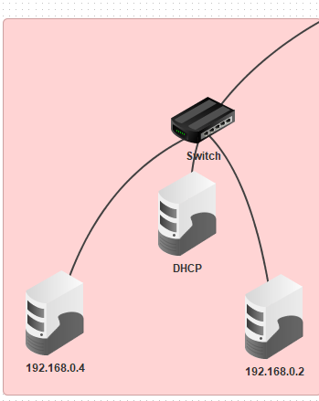
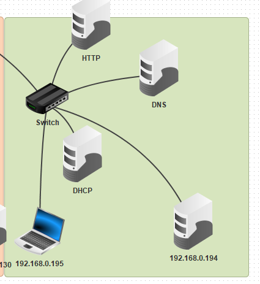

# DHCP-DNS

#### Iniziamo creando 4 sottoreti utilizzando il Subnetting come nei precedenti esercizi svolti, però sta volta aggiugiamo un DHCP ad ogni sottorete e in una rete a nostra scelta mettiamo un DNS servere e un HTTP.
#### Un DNS servere in poche parole converte il dominio in indirizzo IP, esempio(se noi cerchiamo su google "libero.it" verra invita una richiesta al DNS server e questo convertirà "libero.it" in un indirizzo IP e verremo mandati alla pagina di libero.it)
#### HTTP:è un protocollo di rete, il più utilizzato a livello applicativo, che permette lo scambio di informazioni sul web: contiene, infatti, regole e istruzioni indispensabili affinché due macchine collegate in rete possano interagire tra di loro.

 Esempio rete 1

#### Fare così per tutte le 4 reti, però nell'ultima bisogna inserire anche un DNS server e un HTTP come nella foto seguente.

#### Tornando all'esercizio, dopo aver messo in ogni sottorete un DHCP e in una rete a nostra scelta un DNS Server e un HTTP,dobbiamo fare in modo che il DHCP fornisca un indirizzo IP ad ogni dispositivo, poi fare in modo che quando facciamo un ping
#### al dominio "SIRulez.it" inserito nel DNS server ci venga restituito l'indirizzo IP del sito, e infine fare in modo che l'HTTP fornisca le proprie pagine web con dominio "SIRulez.it"
